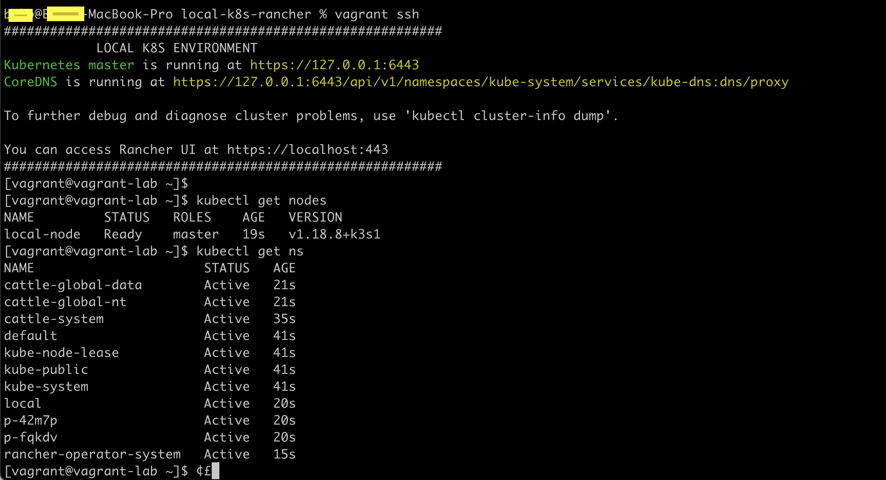
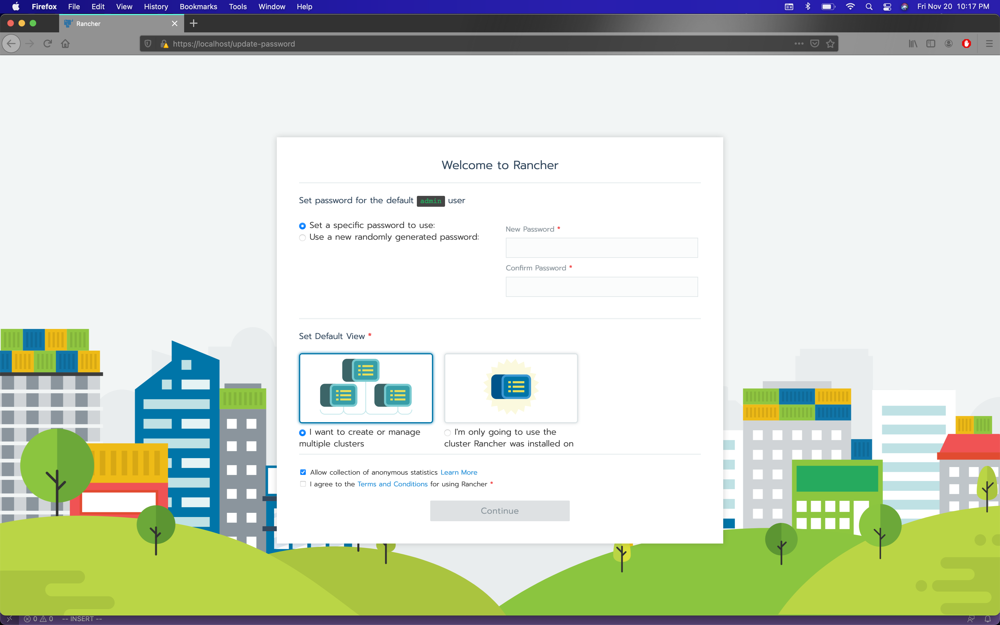
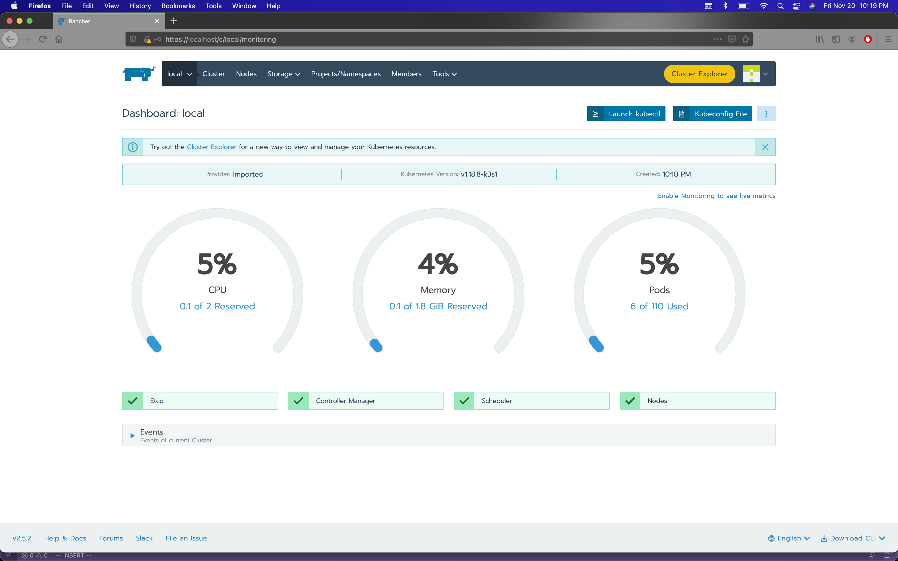

# Local K8S Rancher environment

This repo creates a local CentOS 8 VM running Docker and k8s/Rancher UI to quickly have a local sandbox to use these tools for development.

## Prerequisites

You will need access to the internet, plus Vagrant and VitrualBox (or your choice of hypervisor) installed on your host machine.

Vagrant Download: <https://www.vagrantup.com/downloads>
VirtualBox Download: <https://www.virtualbox.org/wiki/Downloads>

Additionally you should clone this repo to your host machine.

```bash
git clone https://github.com/BoLB23/local-k8s-rancher.git
```

## Usage

```bash
cd local-k8s-rancher
vagrant up
```

After several minutes your VM should spin up and the provision ansible playbook should run.

Once this is complete. SSH into your vagrant VM to ensure rancher and docker is up.

```bash
vagrant ssh

docker ps

kubectl get nodes
kubectl get ns
```



Log into the rancher UI (optional).

<https://localhost:443/login>






## Contributing
Pull requests are welcome. 
